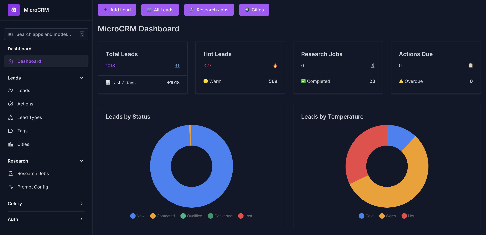
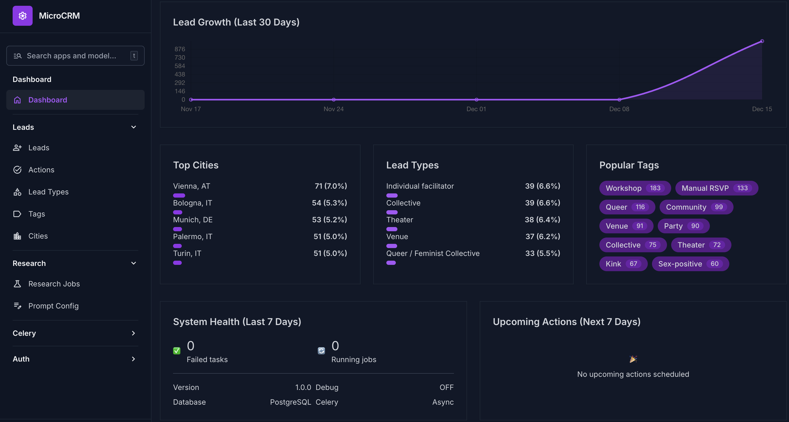
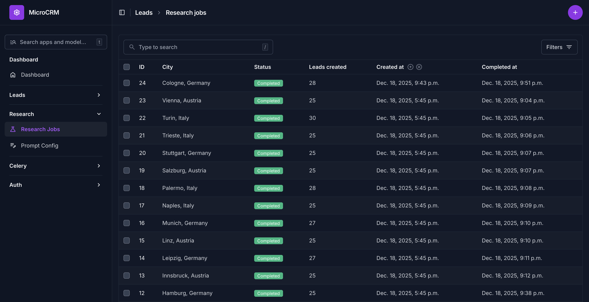

# MicroCRM

**A lightweight, AI-powered CRM for lead management and research.**

<!-- Status & Version -->
[](https://github.com/biagiodistefano/microcrm/releases)
[](./LICENSE)

<!-- CI/CD -->
[](https://github.com/biagiodistefano/microcrm/actions/workflows/test.yaml)
[](https://github.com/biagiodistefano/microcrm/actions/workflows/build.yaml)

<!-- Stack -->

[](https://unfoldadmin.com)

<!-- Tooling -->


---

MicroCRM is a modern lead management system designed to streamline outreach and discovery for event promotion. Built initially to power lead generation for [Revel](https://github.com/letsrevel), it's fully generic and can be adapted for any business needing smart lead tracking.

What sets it apart is its **AI-powered research capabilities** using Google's Gemini Deep Research to automatically discover and enrich leads in specific cities based on customizable criteria.

---

## Why MicroCRM?

Traditional CRMs are either too complex (enterprise-focused with endless features) or too simple (basic contact lists). MicroCRM hits the sweet spot:

*   **Lightweight & Fast:** Built with modern Django, optimized for speed and simplicity.
*   **AI-Powered Research:** Leverage Google Gemini Deep Research to automatically discover leads in target cities based on your custom criteria.
*   **Smart Deduplication:** Automatically merges research results with existing leads, filling in blanks without overwriting valuable data.
*   **REST API First:** Fully documented API (Django Ninja) for easy integration with other tools.
*   **Self-Hostable:** Run it on your own infrastructure, keep control of your data.

---

## Screenshots

<div align="center">

**Dashboard Overview**





**AI Research Jobs**



</div>

---

## Key Features

#### Lead Management
*   **Full CRUD API:** Create, read, update, and delete leads with pagination, filtering, and full-text search.
*   **Rich Lead Data:** Track contact info (email, phone, telegram, instagram), company details, location, status, temperature, and custom tags.
*   **Action Tracking:** Schedule and track follow-up actions for each lead with due dates and status.
*   **Historical Tracking:** Every change to a lead or action is tracked with django-simple-history.
*   **Flexible Categorization:** Use lead types and tags for multi-dimensional organization.

#### AI Research (Gemini Deep Research)
*   **Automated Discovery:** Start research jobs for specific cities to automatically discover relevant leads.
*   **Customizable Prompts:** Configure research criteria via admin interface using template variables.
*   **Background Processing:** Celery-powered async jobs with progress tracking and status monitoring.
*   **Smart Merging:** Auto-deduplicates by email, instagram, website, or name+city combo, filling blanks only.

#### Modern Admin Interface
*   **Beautiful UI:** Built with django-unfold for a clean, modern admin experience.
*   **Google SSO:** Secure authentication with Google single sign-on.
*   **Task Monitoring:** View Celery task results and periodic schedules directly in admin.

---

## Tech Stack

*   **Backend:** Python 3.14+ with **[Django 5.2+](https://docs.djangoproject.com/en/5.2/)**
*   **API:** **[Django Ninja](https://django-ninja.dev/)** and **[Django Ninja Extra](https://eadwincode.github.io/django-ninja-extra/)** for a fast, modern, and auto-documenting REST API.
*   **AI:** **[Google Gemini](https://ai.google.dev/)** Deep Research for automated lead discovery.
*   **Async Tasks:** **Celery** with **Redis** for background research jobs.
*   **Package Manager:** **[uv](https://github.com/astral-sh/uv)** for blazing-fast dependency management.
*   **Database:** **SQLite** (dev), **PostgreSQL** (prod).
*   **Deployment:** Fully containerized with **Docker** for easy setup and deployment.

---

## Quick Start (Docker - Recommended for Users)

Run MicroCRM locally with **zero hassle** using Docker Desktop. No Python or development tools required.

### Prerequisites
- [Docker Desktop](https://www.docker.com/products/docker-desktop/) installed and running

### Setup

1.  **Clone the repository:**
    ```bash
    git clone https://github.com/biagiodistefano/microcrm.git
    cd microcrm
    ```

2.  **Run the setup wizard:**
    ```bash
    ./local_wizard.sh
    ```

    The wizard will:
    - Check that Docker is running
    - Prompt you for admin credentials (defaults: `admin` / `admin`)
    - Ask for your Gemini API key (optional, for AI research features)
    - Build and start all services

3.  **Access the application:**
    - **Admin Panel:** http://localhost:8000/admin/
    - **API Docs:** http://localhost:8000/api/docs

### Wizard Commands

```bash
./local_wizard.sh          # Interactive menu
./local_wizard.sh start    # First-time setup
./local_wizard.sh stop     # Stop all services
./local_wizard.sh logs     # View logs
./local_wizard.sh status   # Check container status
./local_wizard.sh restart  # Restart services
./local_wizard.sh reset    # Remove everything and start fresh
```

---

## Quick Start (Development)

For developers who want to modify the code. You'll need `make`, Python 3.14+, and [uv](https://github.com/astral-sh/uv).

1.  **Clone the repository:**
    ```bash
    git clone https://github.com/biagiodistefano/microcrm.git
    cd microcrm
    ```

2.  **Start Redis** (required for Celery):
    ```bash
    docker compose -f compose.dev.yaml up -d
    ```

3.  **Run the setup command:**
    This creates your `.env` file, installs dependencies, runs migrations, and seeds sample data.
    ```bash
    make setup
    ```

4.  **Configure Google Gemini (Optional):**
    To use AI research features, add your Gemini API key to `.env`:
    ```bash
    GEMINI_API_KEY=your_api_key_here
    ```
    Get a free API key at [ai.google.dev](https://ai.google.dev/)

5.  **You're ready!**
    *   Start the dev server: `make run`
    *   The admin is at `http://localhost:8000/admin/` (login: `admin` / `admin`)
    *   Interactive API docs (Swagger UI) are at `http://localhost:8000/api/docs`
    *   For AI research, start Celery: `make run-celery` and `make run-celery-beat`

---

## Development Commands

The project uses a `Makefile` to streamline common development tasks.

| Command              | Description                                                      |
| -------------------- | ---------------------------------------------------------------- |
| `make setup`         | One-time setup: creates `.env`, installs deps, runs migrations, seeds data. |
| `make run`           | Starts the Django development server.                            |
| `make check`         | Runs all checks: formatting (ruff), linting, and type checking (mypy strict). |
| `make test`          | Runs the full `pytest` test suite and generates a coverage report. |
| `make test-failed`   | Re-runs only previously failed tests.                            |
| `make run-celery`    | Starts the Celery worker for processing background tasks.        |
| `make run-celery-beat` | Starts the Celery beat scheduler for periodic tasks.           |
| `make migrations`    | Creates new database migrations based on model changes.          |
| `make migrate`       | Applies pending database migrations.                             |
| `make bootstrap`     | Creates superuser and reference data (production-safe).          |
| `make seed`          | Loads fake lead data for development (NOT for production).       |
| `make shell`         | Opens the Django shell.                                          |
| `make nuke-db`       | **Deletes** the database and all migration files. Use with caution. |
| `make release`       | Creates a GitHub release from the current version in `pyproject.toml`. |

---

## Project Structure

The codebase is organized into a `src` directory with a clear separation of concerns.

```
microcrm/
├── local_wizard.sh       # Docker setup wizard for end-users
├── compose.local.yaml    # Full Docker stack (web, celery, beat, redis)
├── compose.dev.yaml      # Redis only (for developers)
├── Dockerfile            # Production-ready container image
├── Makefile              # Development commands
└── src/
    ├── crm/              # Django project settings, API, dashboard
    └── leads/            # Main app (models, API, tasks, admin)
```

*   `src/crm/`: The core Django project settings, API configuration, and admin dashboard.
*   `src/leads/`: The main app containing all CRM functionality:
    *   `models.py`: Database models (Lead, Action, City, LeadType, Tag, ResearchJob, etc.)
    *   `schema.py`: Pydantic schemas for API requests/responses
    *   `controllers.py`: API endpoints (Django Ninja controllers)
    *   `service.py`: Business logic layer (lead creation, related object handling)
    *   `tasks.py`: Celery tasks for AI research jobs
    *   `admin.py`: Django admin configuration
    *   `tests/`: Pytest test suite

---

## API Quick Reference

The API is fully documented at `/api/docs`. Here's a quick overview:

### Authentication
API key authentication via `X-API-Key` header (disabled in DEBUG mode).

### Endpoints

**Leads**
- `GET /api/leads/` - List leads (paginated, searchable, filterable)
- `GET /api/leads/{id}` - Get single lead
- `POST /api/leads/` - Create lead
- `PUT /api/leads/{id}` - Update lead (full replacement)
- `PATCH /api/leads/{id}` - Partial update
- `DELETE /api/leads/{id}` - Delete lead

**Actions**
- `GET /api/actions/` - List actions (paginated, searchable, filterable)
- `GET /api/actions/{id}` - Get single action
- `POST /api/actions/` - Create action for a lead
- `PUT /api/actions/{id}` - Update action (full replacement)
- `PATCH /api/actions/{id}` - Partial update
- `DELETE /api/actions/{id}` - Delete action

**Research Jobs**
- `GET /api/research-jobs/` - List research jobs (paginated)
- `GET /api/research-jobs/{id}` - Get job details with results
- `POST /api/research-jobs/` - Create new research job
- `POST /api/research-jobs/{id}/run` - Start or retry a job
- `POST /api/research-jobs/{id}/reprocess` - Retry parsing without re-running research
- `DELETE /api/research-jobs/{id}` - Delete job (only if not running)

**Related Objects**
- `GET /api/cities/` - List cities
- `GET /api/cities/{id}` - Get single city
- `POST /api/cities/` - Create city
- `POST /api/cities/{id}/research` - Start research for a city
- `GET /api/lead-types/` - List lead types
- `GET /api/tags/` - List tags

**Health**
- `GET /api/health` - Health check

### Example: Create a Lead
```bash
curl -X POST http://localhost:8000/api/leads/ \
  -H "Content-Type: application/json" \
  -d '{
    "name": "Berlin Techno Collective",
    "email": "info@btc.de",
    "lead_type": "Collective",
    "city": {"name": "Berlin", "country": "Germany", "iso2": "DE"},
    "tags": ["Techno", "LGBTQ+", "Nightlife"],
    "status": "new",
    "temperature": "warm"
  }'
```

---

## AI Research Guide

### How It Works

1. **Configure your research prompt** in Admin → Research → Prompt Config
   - Use variables: `{city}`, `{lead_types}`, `{schema}`
2. **Start a research job** in Admin → Research → Research Jobs → Add
   - Select a city
   - Job runs in background via Celery
3. **Monitor progress** via job status (pending → running → completed/failed)
4. **Review results** in the lead list (source: "Gemini Deep Research")

### Lead Deduplication Logic

When research completes, the system smartly merges results:
- **Match by:** email → phone → instagram → telegram → website → name+city
- **If found:** fills only blank fields (non-destructive)
- **If new:** creates lead with all research data
- **Tags:** always additive (never removes existing tags)

---

## Configuration

Configuration is managed via environment variables in `.env`. See `.env.example` for all options.

### Key Variables

```bash
# Superuser (created by bootstrap command)
SUPERUSER_USERNAME=admin
SUPERUSER_EMAIL=admin@example.com
SUPERUSER_PASSWORD=admin

# Django
SECRET_KEY=your-secret-key-here
DEBUG=True
ALLOWED_HOSTS=localhost,127.0.0.1
ADMIN_URL=admin/  # Customize admin path

# API
API_KEY=your-api-key-here

# AI Research
GEMINI_API_KEY=your-gemini-key-here

# Celery (requires Redis)
REDIS_HOST=localhost
REDIS_PORT=6379
CELERY_TASK_ALWAYS_EAGER=True  # Set to False for async (requires Redis)

# Google SSO (optional)
GOOGLE_SSO_CLIENT_ID=your-client-id
GOOGLE_SSO_CLIENT_SECRET=your-client-secret
GOOGLE_SSO_SUPERUSER_LIST=admin@example.com,other@example.com
```

---

## Production Deployment

### Docker Compose Files

| File | Purpose | Use Case |
|------|---------|----------|
| `compose.prod.yaml` | Full production stack with Caddy, PostgreSQL | VPS/Cloud deployment |
| `compose.local.yaml` | Full stack (web, celery, beat, redis) | End-users running locally |
| `compose.dev.yaml` | Redis only | Developers (run Django with `make run`) |

### Quick Production Deploy

Deploy to any VPS (DigitalOcean, Linode, Hetzner, etc.) with the production wizard:

```bash
# Clone the repo on your server
git clone https://github.com/biagiodistefano/microcrm.git
cd microcrm

# Run the production wizard
./prod_wizard.sh
```

The wizard will:
- Prompt for your domain (e.g., `crm.example.com`)
- Configure admin credentials
- Set up PostgreSQL with a secure password
- Optionally configure Google SSO
- Start all services with automatic HTTPS via Caddy

#### Wizard Commands

```bash
./prod_wizard.sh          # Interactive menu
./prod_wizard.sh deploy   # First-time deployment
./prod_wizard.sh stop     # Stop all services
./prod_wizard.sh logs     # View logs
./prod_wizard.sh update   # Pull latest code and rebuild
./prod_wizard.sh backup   # Backup PostgreSQL database
```

### DigitalOcean One-Click Deploy

1. Create a new Droplet (Ubuntu 22.04+, 1GB+ RAM)
2. Use the cloud-init script from `.do/cloud-init.yaml` as user-data
3. Point your domain's DNS to the Droplet IP
4. SSH in and run:
   ```bash
   cd /opt/microcrm
   ./prod_wizard.sh
   ```

**Non-interactive deployment** (set these environment variables before creating the droplet):
```bash
MICROCRM_DOMAIN=crm.example.com
MICROCRM_ADMIN_USER=admin
MICROCRM_ADMIN_EMAIL=admin@example.com
MICROCRM_ADMIN_PASSWORD=secure-password
MICROCRM_GEMINI_KEY=your-gemini-key  # Optional
```

### Production Architecture

- **Caddy**: Reverse proxy with automatic HTTPS (Let's Encrypt)
- **Web**: Django/Gunicorn (2 workers)
- **Celery**: Background task processing (concurrency: 2)
- **Beat**: Periodic task scheduler
- **PostgreSQL**: Production database
- **Redis**: Celery message broker

### Required Production Settings

The `prod_wizard.sh` handles all of this, but for reference:

```bash
# Domain - single source of truth for production
# settings.py automatically derives ALLOWED_HOSTS and CSRF_TRUSTED_ORIGINS from this
DOMAIN=crm.example.com

# The bootstrap command configures Django Site for SSO
```

**How `DOMAIN` works in `settings.py`:**
```python
if DOMAIN:
    ALLOWED_HOSTS = [DOMAIN]                    # e.g., ["crm.example.com"]
    CSRF_TRUSTED_ORIGINS = [f"https://{DOMAIN}"]  # e.g., ["https://crm.example.com"]
```

**Important:** Without proper CSRF configuration, you'll get 403 errors on all POST requests in the admin panel.

### Security Features (Production Mode)

When `DEBUG=False`, these are automatically enabled:
- `SECURE_PROXY_SSL_HEADER` for HTTPS behind Caddy
- `CSRF_COOKIE_SECURE` for secure cookie transmission
- `SESSION_COOKIE_SECURE` for secure session cookies
- Caddy adds security headers (X-Frame-Options, X-Content-Type-Options, etc.)

---

## Testing

The project uses pytest with django integration. All tests live in `src/leads/tests/`.

```bash
# Run all tests with coverage
make test

# Run specific test file
uv run pytest src/leads/tests/test_service.py -v

# Run specific test function
uv run pytest src/leads/tests/test_service.py::test_create_lead -v

# Re-run only failed tests
make test-failed
```

Test configuration uses in-memory SQLite and Celery eager mode for fast execution.

---

## Contributing

Contributions are welcome! Here's how you can help:

1. **Report bugs** via GitHub issues
2. **Suggest features** you'd like to see
3. **Submit PRs** with bug fixes or new features

### Code Quality

Before submitting, ensure your code passes:
```bash
make check  # Runs ruff format, ruff lint, and mypy --strict
make test   # Runs full test suite
```

We follow:
- **Google-style docstrings**
- **Type hints** on all functions (mypy strict mode)
- **Test coverage** for new features
- **Max complexity** of 10 (McCabe)

---

## License

This project is licensed under the MIT license. See [LICENSE](LICENSE).

---

## Acknowledgements

Built with love for the [Revel](https://github.com/letsrevel) community.

Powered by:
- [Django](https://www.djangoproject.com/)
- [Django Ninja](https://django-ninja.dev/)
- [Google Gemini](https://ai.google.dev/)
- [Unfold Admin](https://github.com/unfoldadmin/django-unfold)
